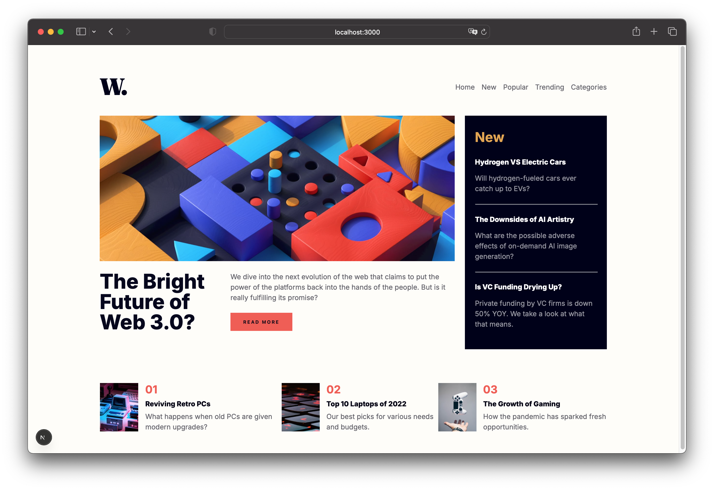
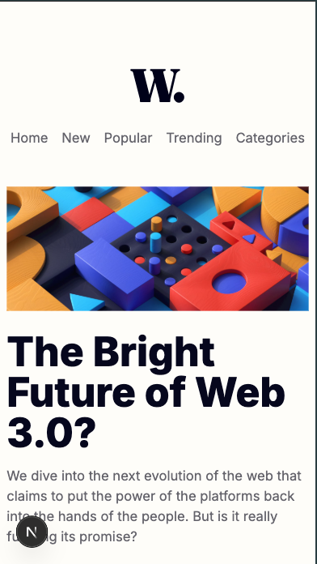
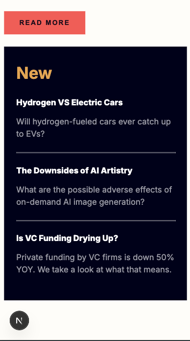
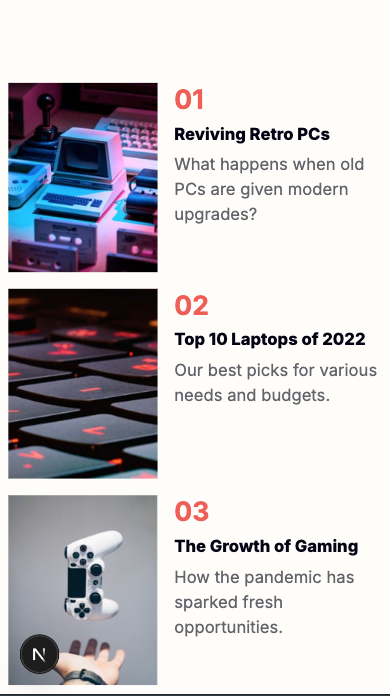

# Frontend Mentor - News homepage solution

This is a solution to the [News homepage challenge on Frontend Mentor](https://www.frontendmentor.io/challenges/news-homepage-H6SWTa1MFl). Frontend Mentor challenge helped me improve my coding skills by building this realistic project. 

## Table of contents

- [Overview](#overview)
  - [The challenge](#the-challenge)
  - [Screenshot](#screenshot)
- [My process](#my-process)
  - [Built with](#built-with)
  - [What I learned](#what-i-learned)
  - [Continued development](#continued-development)
  - [Useful resources](#useful-resources)
- [Author and Acknowledgements](#author)

## Overview

### The challenge

Users are able to:

- View the optimal layout for the interface depending on their device's screen size
- See hover and focus states for all interactive elements on the page

### Screenshot

Responisve design versions: 
- Desktop version:

- Mobile version:

## My process

### Built with

- Semantic HTML5 markup
- CSS custom properties
- Flexbox
- CSS Grid
- Responsive design
- [React](https://reactjs.org/) - JS library
- [Next.js](https://nextjs.org/) - React framework

### What I learned

I've learned how to build a web page using React library and Next.js framework.

### Continued development

Improve React skills and other js frameworks.

### Useful resources

- [React](https://react.dev/) 
- [Next](https://nextjs.org/) 
- [Frontend Mentor](https://www.frontendmentor.io/challenges/news-homepage-H6SWTa1MFl) 

## Authors and Acknowledgements

- Author - [@nadejda-g](https://github.com/nadejda-g)
- Template - [@Frontend Mentor](https://www.frontendmentor.io)
- Mentor - [@dragomirt](https://github.com/dragomirt)
